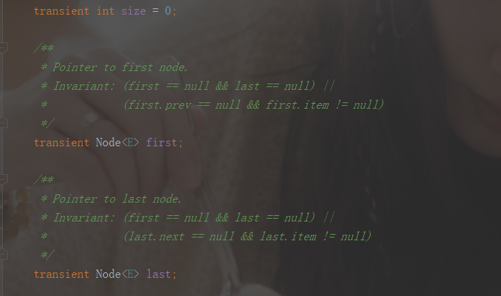
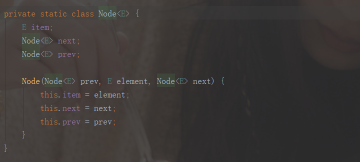
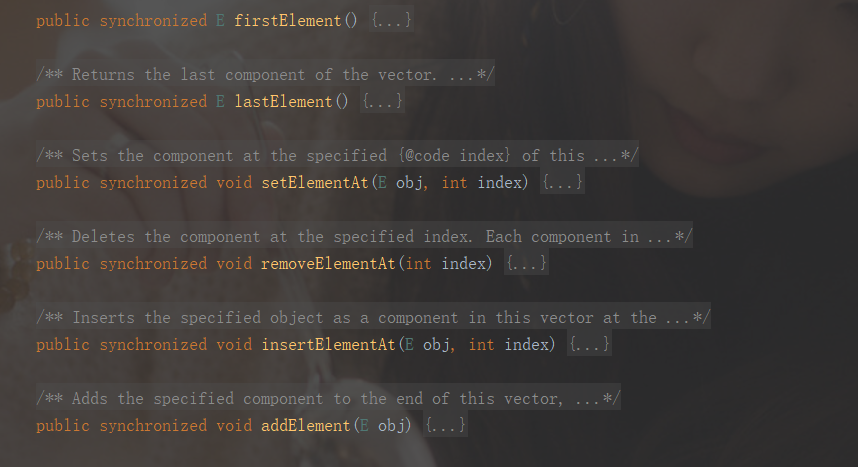
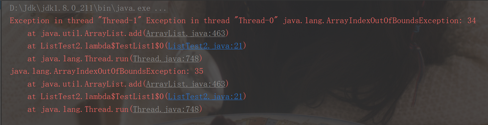
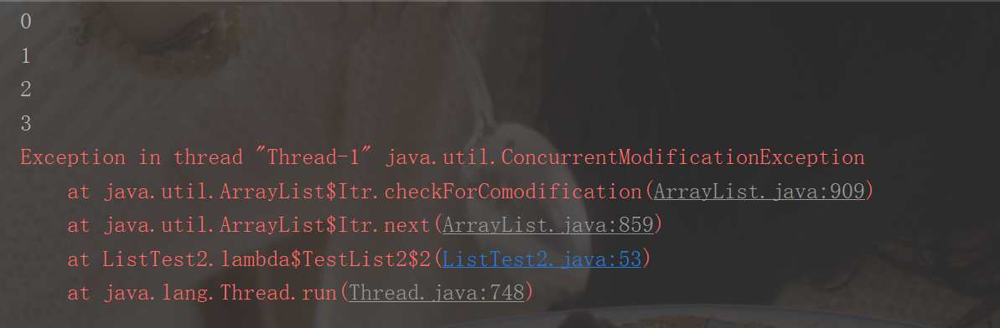
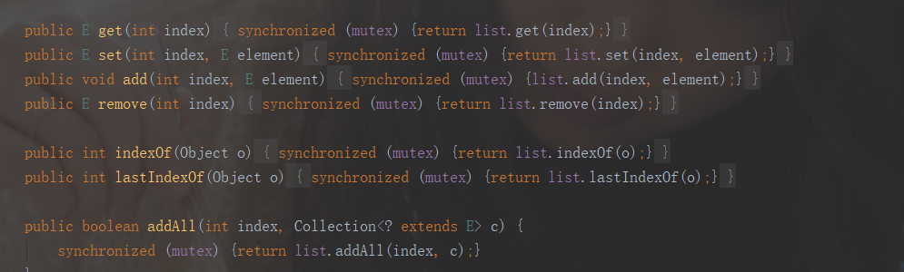
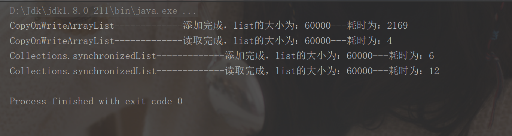

# List集合

## 1. ArrayList

ArrayList是我们常用的list集合之一，主要用来装载基本数据类型(byte,short,int,long,char,boolean,float,double)和我们自己封装的对象。ArrayList的底层实现是Object[]数组，这也就导致了它的查询效率高，增删效率低下。

```java
transient Object[] elementData; //ArrayList底层定义的数组
```

在实例化ArrayList时，我们可以传入初始数组容量，也可以不传。

在传入初始容量参数时，若参数为0，则将elementData赋值为空数组；若参数大于0，则新建一个数组Object[initialCapacity]，并赋值给elementData。

```java
private static final Object[] EMPTY_ELEMENTDATA = {};

public ArrayList(int initialCapacity) {
    //容量参数判断
    if (initialCapacity > 0) {
        this.elementData = new Object[initialCapacity];
    } else if (initialCapacity == 0) {
        this.elementData = EMPTY_ELEMENTDATA; //赋值为定义的空数组
    } else {
        throw new IllegalArgumentException("Illegal Capacity: "+
                                           initialCapacity);
    }
}
```

在不传初始容量参数时，则将elementData赋值为空数组。**注意，只有真正对list进行添加add时，才分配默认DEFAULT_CAPACITY = 10的初始容量。**

```java
private static final Object[] DEFAULTCAPACITY_EMPTY_ELEMENTDATA = {};

public ArrayList() {
        this.elementData = DEFAULTCAPACITY_EMPTY_ELEMENTDATA;
    }
```


查询效率高：通过数组的索引直接返回数值，效率高。

```java
public E get(int index) {
    rangeCheck(index);//判断索引是否越界
    return elementData(index); //根据索引查询数值
}

E elementData(int index) {
        return (E) elementData[index];
    }
```

增删效率低：主要是会涉及到数组扩容和复制。

下面是对数组增加元素进行一个详细的讲解。在第一次添加元素之前，elementData为空，size为0。在执行add()方法时，calculateCapacity()方法会返回DEFAULT_CAPACITY(默认为10)和minCapacity最大的值作为list初始容量的大小。然后会对添加元素之后的数组长度与当前数组长度进行比较，若大于当前数组的长度，则执行扩容grow(minCapacity)方法。

```java
public boolean add(E e) {
    ensureCapacityInternal(size + 1);  // Increments modCount!!
    elementData[size++] = e;
    return true;
}

private void ensureCapacityInternal(int minCapacity) {
        ensureExplicitCapacity(calculateCapacity(elementData, minCapacity));
    }

private static int calculateCapacity(Object[] elementData, int minCapacity) {
        if (elementData == DEFAULTCAPACITY_EMPTY_ELEMENTDATA) {
            return Math.max(DEFAULT_CAPACITY, minCapacity);
        }
        return minCapacity;
    }

private void ensureExplicitCapacity(int minCapacity) {
        modCount++; //此处的modCount继承自AbstractList，跟迭代器相关，是记录迭代过程中集合被修改的次数

        // overflow-conscious code
        if (minCapacity - elementData.length > 0)
            grow(minCapacity);
    }

private void grow(int minCapacity) {
        // overflow-conscious code
        int oldCapacity = elementData.length;
        int newCapacity = oldCapacity + (oldCapacity >> 1);//数组的容量若为10，扩容后容量为10+5
        if (newCapacity - minCapacity < 0)
            newCapacity = minCapacity;
        if (newCapacity - MAX_ARRAY_SIZE > 0)
            newCapacity = hugeCapacity(minCapacity);
        // minCapacity is usually close to size, so this is a win:
    
        //数组的复制
        elementData = Arrays.copyOf(elementData, newCapacity);
    }
```

在grow方法中，minCapacity=10，旧容量为0，所以新容量就等于minCapacity，然后执行copyOf方法将旧数组复制到新数组中。

```java
public static <T,U> T[] copyOf(U[] original, int newLength, Class<? extends T[]> newType) {
    @SuppressWarnings("unchecked")
    T[] copy = ((Object)newType == (Object)Object[].class)
        ? (T[]) new Object[newLength]
        : (T[]) Array.newInstance(newType.getComponentType(), newLength);
    System.arraycopy(original, 0, copy, 0,
                     Math.min(original.length, newLength));
    return copy;
}
```

因为是第一次添加值，旧数组为空，所以新数组是Capacity为10的空数组。此时，新数组建立好了，add(E e)方法中的elementData[size++] = e就是将数据e添加到新数组的索引0处，添加完成后，数组的为1，即下次从1开始添加。在list之后的扩容中，新数组的大小为旧数组的Capacity+Capacity/2，即1.5倍。

在删除元素时，我们可以看到，ArrayList的remove方法本质上还是在调用System.arraycopy方法进行数组的复制。

```java
public E remove(int index) {
    rangeCheck(index);

    modCount++;
    E oldValue = elementData(index);

    int numMoved = size - index - 1;
    if (numMoved > 0)
        System.arraycopy(elementData, index+1, elementData, index,
                         numMoved);
    elementData[--size] = null; // clear to let GC do its work

    return oldValue;
}
```

此外，删除掉数组中的元素之后，数组的容量并不会减小，主要是防止再次添加数据时引发数组扩容所导致的耗时问题，此处，使用一个小demo进行验证。

```java
/**
 * @author 小青年
 * @version 1.0
 * @date 2021/7/11 12:45
 * @description:
 */
public class demo1 {
    public static void main(String[] args) {
        ArrayList<Integer> list = new ArrayList<>();
        for (int i = 0; i < 25; i++) {
            list.add(i);
            System.out.println("添加元素-----list的size为：" + list.size() + "---------" + "list的capacity为：" + getArrayListCapacity(list));
        }
        for (int i = 24; i >=0; i--) {
            list.remove(i);
            System.out.println("删除元素-----list的size为：" + list.size() + "---------" + "list的capacity为：" + getArrayListCapacity(list));
        }
    }

    private static int getArrayListCapacity(ArrayList<?> arrayList) {
        Class<ArrayList> arrayListClass = ArrayList.class;
        try {
            // 获取elementData字段
            Field field = arrayListClass.getDeclaredField("elementData");
            field.setAccessible(true);
            // 通过反射获取elementData字段的值
            Object[] objects = (Object[]) field.get(arrayList);
            return objects.length;
        } catch (NoSuchFieldException e) {
            System.out.println(e);
            return -1;
        } catch (IllegalAccessException e) {
            System.out.println(e);
            return -1;
        }
    }
}
```

从执行结果可以看出，在第一次添加元素后，数组的容量被初始化为10。之后再往数组中添加数据，数组进行了三次扩容，容量分别增至15，22和33，即以1.5倍的方式扩容。在删除数据时，数组的容量始终保持不变。


最后，从上面调用的方法就可以看出，ArrayList是一个线程不安全的集合。

## 2. LinkedList

顾名思义，LinkedList底层就是链表。在查询时，需要遍历集合，而插入、删除时只需要改变前后两个节点指针指向。

LinkedList中维护了size、first和last三个属性，可以快速的获取List的大小以及快速操作首尾节点。



节点是一个双向节点



添加节点：

```java
public boolean add(E e) {
    //在链表末尾添加节点
    linkLast(e);
    return true;
}
```

```java
void linkLast(E e) {
    final Node<E> l = last;
    //构造一个新节点，前向节点为原链表最后一个节点，后向节点为空
    final Node<E> newNode = new Node<>(l, e, null);
    //修改末尾节点
    last = newNode;
    if (l == null)
        //原始链表为空
        first = newNode;
    else
        //原链表最后一个节点的next指针指向新节点
        l.next = newNode;
    //LinkedList的size加1
    size++;
    modCount++;
}
```

删除指定索引的节点(在指定索引添加节点原理类似)：

```java
public E remove(int index) {
    //索引检查
    checkElementIndex(index);
    return unlink(node(index));
}

```

```java
Node<E> node(int index) {
    // assert isElementIndex(index);
	//若索引小于当前链表大小的一半，则从前遍历，否则从后遍历
    if (index < (size >> 1)) {
        Node<E> x = first;
        for (int i = 0; i < index; i++)
            x = x.next;
        return x;
    } else {
        Node<E> x = last;
        for (int i = size - 1; i > index; i--)
            x = x.prev;
        return x;
    }
}
```

```java
E unlink(Node<E> x) {
    // assert x != null;
    final E element = x.item;
    final Node<E> next = x.next;
    final Node<E> prev = x.prev;
	//先解绑当前节点的左边指向
    if (prev == null) {
        //删除的是首节点
        first = next;
    } else {
        //将当前节点的前一节点的next指针指向当前节点的后一节点
        prev.next = next;
        //当前节点的前向指针指向空
        x.prev = null;
    }
	//后解绑当前节点的后向
    if (next == null) {
        //删除的是尾节点
        last = prev;
    } else {
        //将当前节点的下一节点的pre指针指向当前节点的前一节点
        next.prev = prev;
        //当前节点的后向指针指向空
        x.next = null;
    }
	//删除当前节点的值
    x.item = null;
    //LinkedList的size减1
    size--;
    modCount++;
    return element;
}
```


## 3. Vector（基本不用）

线程安全的List，操作方法是**同步**的(在方法上加了synchronized关键字)，基本原理与ArrayList极为相似。



```java
public Vector() {
    this(10);//默认初始容量为10
}
```


```java
private void grow(int minCapacity) {
    // overflow-conscious code
    int oldCapacity = elementData.length;
    int newCapacity = oldCapacity + ((capacityIncrement > 0) ?
                                     capacityIncrement : oldCapacity);
    //capacityIncrement为扩容增量，默认为0；在扩容时，如果增量不为0，则每次容量不足时按照增量去增加容量。如果增量为0，则每次容量不足时会将当前容量翻倍。
    if (newCapacity - minCapacity < 0)
        newCapacity = minCapacity;
    if (newCapacity - MAX_ARRAY_SIZE > 0)
        newCapacity = hugeCapacity(minCapacity);
    //数组复制
    elementData = Arrays.copyOf(elementData, newCapacity);
}
```

## 4. 线程安全的List

ArrayList不是线程安全的，在多线程情况下向添加数据时，会产生ArrayIndexOutOfBoundsException(索引越界异常)。

```java
@Test
public void TestList1() throws InterruptedException {
    ArrayList<Integer> list = new ArrayList<>();
    Runnable runnable = () -> {
        for (int i = 0; i < 30000; i++) {
            list.add(i);
        }
    };
    Thread one = new Thread(runnable);
    Thread two = new Thread(runnable);
    one.start();
    two.start();
    one.join();
    two.join();
}
```



并且一个线程在遍历List，另一个线程修改List(使用迭代器的方式)，会报ConcurrentModificationException(并发修改异常)。 ---**快速失败机制**(此外，还有安全失败机制，会在Map集合中讲到)

```java
**
 * @author 小青年
 * @version 1.0
 * @date 2021/7/11 14:51
 * @description:
 */
public class ListTest2 {
    @Test
    public void TestList1() throws InterruptedException {
        ArrayList<Integer> list = new ArrayList<>();
        Runnable runnable = () -> {
            for (int i = 0; i < 30000; i++) {
                list.add(i);
            }
        };
        Thread one = new Thread(runnable);
        Thread two = new Thread(runnable);
        one.start();
        two.start();
        one.join();
        two.join();
    }

    @Test
    public void TestList2() throws InterruptedException {
        ArrayList<Integer> list = new ArrayList<>();
        for (int i = 0; i < 30000; i++) {
            list.add(i);
        }
        Runnable runnable = () -> {
            Iterator<Integer> iterator = list.iterator();
            while (iterator.hasNext()) {
                Integer num = iterator.next();
                if (num == 3){
                    iterator.remove();
                }
                try {
                    Thread.sleep(100);
                } catch (InterruptedException e) {
                    e.printStackTrace();
                }
            }
        };
        Runnable runnable1 = () -> {
            for (int nums : list
            ) {
                System.out.println(nums);
                try {
                    Thread.sleep(100);
                } catch (InterruptedException e) {
                    e.printStackTrace();
                }
            }
        };
        Thread one = new Thread(runnable);
        Thread two = new Thread(runnable1);
        one.start();
        two.start();
        one.join();
        two.join();
    }
}
```



### 4.1 Collections.synchronizedList

Collections.synchronizedList是保证ArrayList线程安全的方式之一，构造方式如下。

```java
List<Integer> list = new ArrayList<Integer>();
list = Collections.synchronizedList(list);
```

在Collections.synchronizedList()源码中，可以看到，根据传入的list对象，生成了一个SynchronizedList对象，在调用相关的方法时，采用了synchronized关键字进行加锁。而锁对象mutex为当前类或者在构造时传入。

```java
public static <T> List<T> synchronizedList(List<T> list) {
    return (list instanceof RandomAccess ?
            new SynchronizedRandomAccessList<>(list) :
            new SynchronizedList<>(list));
}
```

```java
static class SynchronizedList<E>
    extends SynchronizedCollection<E>
    implements List<E> {
    private static final long serialVersionUID = -7754090372962971524L;

    final List<E> list;

    SynchronizedList(List<E> list) {
        super(list);
        this.list = list;
    }
    SynchronizedList(List<E> list, Object mutex) {
        super(list, mutex); //mutex为传入的锁对象
        this.list = list;
    }
}
```



### 4.2  CopyOnWriteArrayList

CopyOnWriteArrayList是保证ArrayList线程安全的另一种方式，该类采用了安全失败机制保证线程安全，构造方式如下。

```java
CopyOnWriteArrayList<Integer> integers = new CopyOnWriteArrayList<>();
```

其余使用方法与ArrayList一致，不过CopyOnWriteArrayList中的增删方法使用了ReentrantLock进行了加锁，而查找方法则与ArrayList一致。

```java
public boolean add(E e) {
    final ReentrantLock lock = this.lock;
    lock.lock(); //上锁
    try {
        Object[] elements = getArray();
        int len = elements.length;
        //安全失败机制，将原数组copy一份，对copy的数组进行操作
        Object[] newElements = Arrays.copyOf(elements, len + 1);
        newElements[len] = e;
        //将新数组替换掉原数组
        setArray(newElements);
        return true;
    } finally {
        //释放锁，防止死锁
        lock.unlock();
    }
}
```


```
public E get(int index) {
    return get(getArray(), index);
}
```

### 4.3 Collections.synchronizedList与CopyOnWriteArrayList的性能对比

我们通过两个线程往List中添加和删除30000个元素，耗时如下。

```java
**
 * @author 小青年
 * @version 1.0
 * @date 2021/7/11 15:52
 * @description:
 */
public class ListTest {

    @Test
    public void TestList1() throws InterruptedException {
        long start = System.currentTimeMillis();
        CopyOnWriteArrayList<Integer> integers = new CopyOnWriteArrayList<>();
        Runnable runnable = () -> {
            for (int i = 0; i < 30000; i++) {
                integers.add(i);
            }
        };
        Thread one = new Thread(runnable);
        Thread two = new Thread(runnable);
        one.start();
        two.start();
        one.join();
        two.join();
        long end = System.currentTimeMillis();
        System.out.println("CopyOnWriteArrayList-------------添加完成，list的大小为：" + integers.size() + "---耗时为：" + (end - start));

        //多线程删除元素
        long start1 = System.currentTimeMillis();
        Runnable runnable1 = () -> {
            for (int i = 0; i < integers.size(); i++) {
                Integer integer = integers.get(i);
            }
        };
        Thread three = new Thread(runnable1);
        Thread four = new Thread(runnable1);
        three.start();
        four.start();
        three.join();
        four.join();
        long end1 = System.currentTimeMillis();
        System.out.println("CopyOnWriteArrayList-------------读取完成，list的大小为：" + integers.size() + "---耗时为：" + (end1 - start1));

    }

    @Test
    public void TestList2() throws InterruptedException {
        long start = System.currentTimeMillis();
        List<Integer> list = new ArrayList<Integer>();
        list = Collections.synchronizedList(list);
        List<Integer> finalList = list;
        Runnable runnable = () -> {
            for (int i = 0; i < 30000; i++) {
                finalList.add(i);
            }
        };
        Thread one = new Thread(runnable);
        Thread two = new Thread(runnable);
        one.start();
        two.start();
        one.join();
        two.join();
        long end = System.currentTimeMillis();
        System.out.println("Collections.synchronizedList-------------添加完成，list的大小为：" + list.size() + "---耗时为：" + (end - start));


        //多线程删除元素
        long start1 = System.currentTimeMillis();
        Runnable runnable1 = () -> {
            for (int i = 0; i < finalList.size(); i++) {
                Integer integer = finalList.get(i);
            }
        };
        Thread three = new Thread(runnable1);
        Thread four = new Thread(runnable1);
        three.start();
        four.start();
        three.join();
        four.join();
        long end1 = System.currentTimeMillis();
        System.out.println("Collections.synchronizedList-------------读取完成，list的大小为：" + list.size() + "---耗时为：" + (end1 - start1));

    }
}
```




从测试结果可以看出，在增删元素时，Collections.synchronizedList的性能要优于CopyOnWriteArrayList；在查找元素时，CopyOnWriteArrayList要优于Collections.synchronizedList。这是因为在增删元素时，Collections.synchronizedList仅仅是加了锁，而CopyOnWriteArrayList不仅加了锁，还进行了内存复制操作；在读取元素时，CopyOnWriteArrayList既没加锁，也没进行内存复制，因此耗时低于Collections.synchronizedList。

以上就是关于List集合的全部内容，若有错误，欢迎指正！

